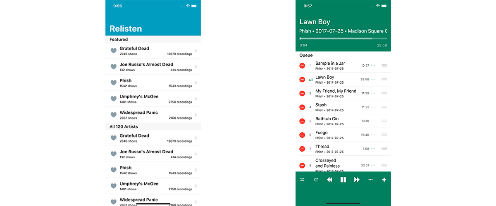

# Relisten iOS

Relisten is an iOS app for streaming millions of free recordings from the [Internet Archive](https://archive.org/details/audio)



# Beta Testing

[Click Here](https://beta.relisten.live/) to add yourself to the beta testing group for Relisten.

You can join the [Discord Chat](https://discord.gg/u8v4The) to provide feedback on the app or discuss live music in general.

# Development: Getting Started

[](https://github.com/RelistenNet/relisten-ios/actions?query=workflow%3A%22iOS+CI%22)

If you'd like to build Relisten iOS you'll need [Cocoapods](http://cocoapods.org). 

Clone the repository, then run the setup script to make sure you have all of the dependencies checked out (they'll check out one directory up from your relisten-ios checkout)

```bash
$ git clone https://github.com/RelistenNet/relisten-ios.git
$ cd relisten-ios
$ ./setup.sh
$ open Relisten.xcworkspace
```

If you're looking for a place to help out we tag good starter bugs with the [Help Wanted](https://github.com/RelistenNet/relisten-ios/issues?q=is%3Aissue+is%3Aopen+label%3A%22help+wanted%22) tag. Feel free to grab an issue and send a PR with a fix.
